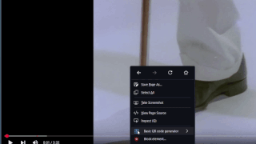

# 🖱️ Access via right click menu!

### ✨Features: 
- 🛜 Offline
- 🪶 Lightweight
- 💨 Quick
- 🚫 No data collection

### 📎Notes:
The word "QR Code" is registered trademark of DENSO WAVE INCORPORATED (http://www.denso-wave.com/qrcode/faqpatent-e.html)

This extension accesses your clipboard to generate QR codes from your copied URL. We do not connect to the internet, so no data is collected or stored.

Current version: ```2024.1.1```

